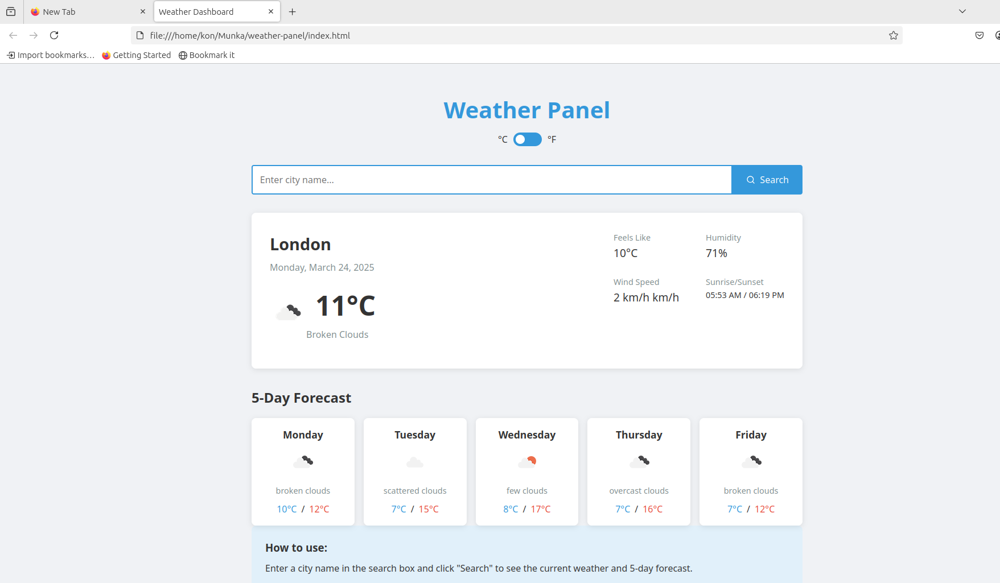

# Weather Panel

A simple, responsive weather dashboard built with vanilla JavaScript that fetches and displays current weather and 5-day forecast data using the OpenWeather API.

[Weather Panel Screenshot]:
.

## Features

- Search for weather information by city name
- Display current weather conditions including:
  - Temperature
  - Weather description with icon
  - "Feels like" temperature
  - Humidity
  - Wind speed
  - Sunrise and sunset times
- 5-day weather forecast
- Responsive design that works on desktop and mobile devices
- Error handling for failed API requests

## Technologies Used

- HTML5
- CSS3
- JavaScript (ES6+)
- OpenWeather API

## Setup and Installation

1. Clone this repository:
   ```
   git clone https://github.com/konmez/weather-panel.git
   ```

2. Navigate to the project directory:
   ```
   cd weather-dashboard
   ```

3. Get your API key:
   - Sign up for a free API key at [OpenWeather](https://openweathermap.org/api)
   - Replace ` API_KEY = '*****************'; ` in the `script.js` file with your actual API key

4. Open `index.html` in your browser to use the application

## Project Structure

- `index.html` - The main HTML structure
- `styles.css` - Contains all styling for the application
- `script.js` - Contains all JavaScript functionality

## How It Works

1. **API Communication**: The application makes two API calls to OpenWeather:
   - Current weather data: `https://api.openweathermap.org/data/2.5/weather`
   - 5-day/3-hour forecast: `https://api.openweathermap.org/data/2.5/forecast`

2. **Data Processing**: The application processes the forecast data from 3-hour intervals into a simplified daily forecast.

3. **Error Handling**: The code includes robust error handling to manage API failures or missing data.

## Code Highlights

### Fetching Weather Data

```javascript
async function fetchWeatherData(city) {
    try {
        // Fetch current weather
        const currentResponse = await fetch(
            `${BASE_URL}/weather?q=${city}&appid=${API_KEY}&units=metric`
        );
        
        if (!currentResponse.ok) {
            throw new Error('City not found');
        }
        
        // Process response...
    } catch (error) {
        showError(error.message);
    }
}
```

### Converting 3-Hour Forecasts to Daily Forecasts

```javascript
function getDailyForecasts(forecastList) {
    // Group forecasts by day
    const dailyForecasts = {};
    
    forecastList.forEach(forecast => {
        // Process each forecast entry...
        // Group by day and calculate min/max temps
    });
    
    // Return array of daily forecasts
    return Object.values(dailyForecasts).slice(0, 5);
}
```

## Future Enhancements

Potential improvements for the future:

- Add geolocation to get the user's current location weather
- Implement a favorites system to save frequently checked cities
- Add weather alerts or warnings if available from the API
- Add additional weather details (UV index, air quality, etc.)
- Add a toggle between metric and imperial units (done)

## License

This project is licensed under the MIT License - see the LICENSE file for details.

## Acknowledgements

- Weather data provided by [OpenWeather](https://openweathermap.org/)
- Weather icons from OpenWeather's [weather icon set](https://openweathermap.org/weather-conditions)
- information, learning material and how-to snippets  from (https://www.w3schools.com/).